# CRUD Application with AWS Lambdas Deployed with Cloud Formation


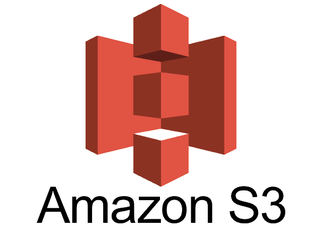
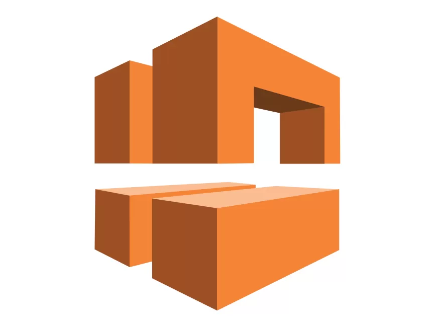


## Introduction

As part of my onboarding to a finance client I was required to learn some AWS skills. I have only dabbled with AWS as a hobby and never used it directly on a project.

To up skill for this role I created a REST API using AWS resources and deployed it into a VPC via Cloud formation.

This post goes into the Technologies I used and the implementation.

Ive tried to implement a solution that automates as much as possible as well as build an API that us unit tested.
I encourage you to go through the repo and explore the implementation.

Github repo: https://github.com/cgungaloo/crud_api_CF

## Technologies

For this Project I use
<ul>
<li><a href="https://www.python.org/">Python</a> A general purpose programming language. We will use this to build out the business logic for the lambdas.</li>
<li><a href="https://pypi.org/project/boto3/">boto3</a> A python library that serves as an AWS client. Used to interact with AWS resources. We use this in our lambda functions to Perform CRUD operations against dynamoDB</li>
<li><a href="https://aws.amazon.com/dynamodb/">AWS DynamoDB</a> A NoSQL Serverless DB service managed by AWS and as such requires no installation on your part you just connect to it through boto3 using an IAM role with sufficient permissions.. We use this service as the DB for our CRUD application. </li> 
<li><a href="https://aws.amazon.com/pm/lambda/?gclid=Cj0KCQiA5rGuBhCnARIsAN11vgSwbY2VZZMY59uih7jf0i8xING5E40hRSexnVEdsSTKoGndmdu3xqgaAn_FEALw_wcB&trk=27324d1f-ee08-40b9-8e7b-5ac228e2fecc&sc_channel=ps&ef_id=Cj0KCQiA5rGuBhCnARIsAN11vgSwbY2VZZMY59uih7jf0i8xING5E40hRSexnVEdsSTKoGndmdu3xqgaAn_FEALw_wcB:G:s&s_kwcid=AL!4422!3!651612449951!e!!g!!aws%20lambda!19836376234!148728884764">AWS Lambdas</a> Lambdas are a serverless AWS resource for writing a range of applications. No managing of services or environments. Code will be uploaded via a zip file to AWS. From my side this makes implementation fairly light weight and allows me to focus more in the application development rather than environment management.</li>
<li><a href="https://docs.aws.amazon.com/AWSCloudFormation/latest/UserGuide/Welcome.html">AWS CloudFormation</a> AWS's answer to infrastructure as code. We will be using this to build out the deployment of our application in the form of a version controlled script. This will include the provisioning of the custom VPC, IAM roles, lambdas, API gateway etc. Cloud formation works on the basis of describing resources as yml code (can also be JSON). When Run. AWS will produce a stack of your resources. The stack can be deleted which in turn will delete all the created resources. It allows the provisioning of resources to be automated as well as groups.</li>
<li><a href="https://aws.amazon.com/cloudwatch/">AWS CloudWatch</a> A service used for capturing application logs. I created a log group that our lambda functions used. I also set up an example of an alarm to send emails when lambda function fails.</li>
<li><a href="https://aws.amazon.com/api-gateway/">AWS API Gateway</a> The Lambdas will be exposed to the outside world as HTTP REST endpoints. API gateway facilitates this as a managed service. This allows lambdas to be swapped out when needed and it is yet another piece of infrastructure managed by AWS.</li>
<li><a href="https://aws.amazon.com/sns/">AWS Simple Notification Service</a> A managed publish and subscribe service. It is versatile messaging service with a number of use cases. For this project I use for sending Emails when the alarm is triggered (Application to person, A2P).</li>
<li><a href="https://aws.amazon.com/pm/serv-s3/?gclid=Cj0KCQiA5rGuBhCnARIsAN11vgSwaFC9cBWcZBTlBzw0ueCz2wkGmnRBiPyoMG8t9p-VIGmItz2sQHsaAqj1EALw_wcB&trk=777b3ec4-de01-41fb-aa63-cde3d034a89e&sc_channel=ps&ef_id=Cj0KCQiA5rGuBhCnARIsAN11vgSwaFC9cBWcZBTlBzw0ueCz2wkGmnRBiPyoMG8t9p-VIGmItz2sQHsaAqj1EALw_wcB:G:s&s_kwcid=AL!4422!3!638364429349!e!!g!!amazon%20s3%20block%20storage!19096959014!142655567223">Simple Storage Solution - S3</a> An object storage solution managed by AWS. We use this to upload zip files of the lambda functions written in python</li>
<li><a href="https://docs.aws.amazon.com/vpc/latest/userguide/what-is-amazon-vpc.html">Virtual Private Cloud - VPC</a>The AWS account will have a default VPC but this application will demonstrate the creation of a custom VPC with cloudformation. A VPC is a logical virtual network inside AWS. Resources inside the VPC will be private to other VPCs in AWS. Subnets are assigned and can be distributed across multiple Availability zones</li>
</ul>

# Implementation

I originally started out this  project by building it manually withing AWS. Once I got it working I then implemented it cloudformation.
Here I will try to demonstrate the key components side by side.

## Architectural Diagram:

This is  a simplified diagram of the application and how its deployed in AWS.

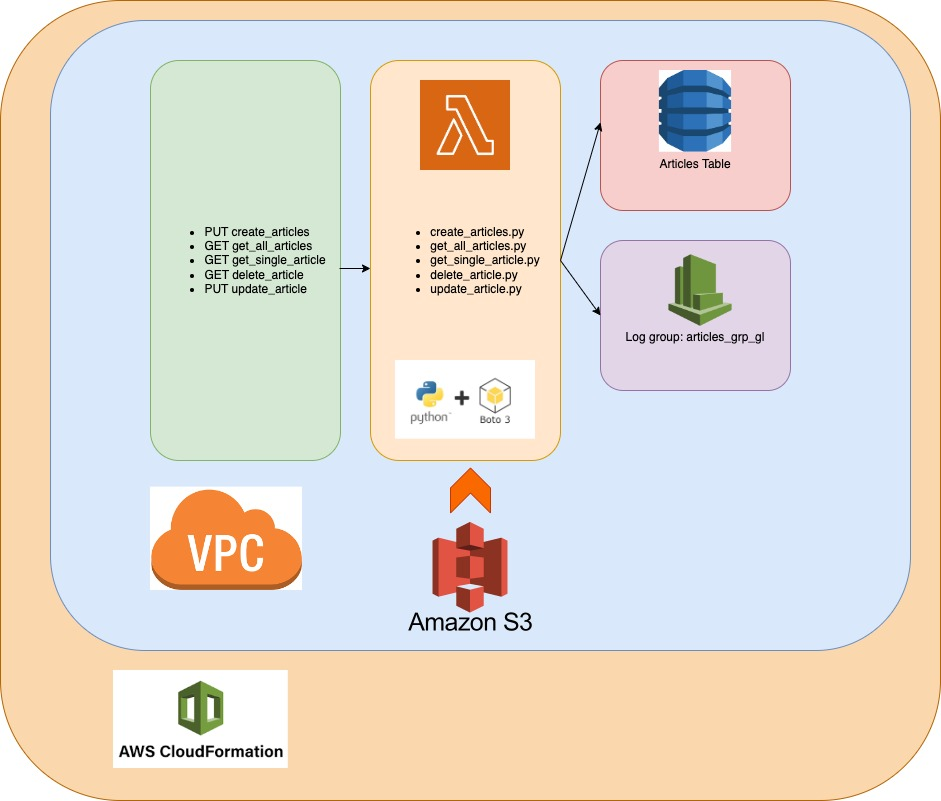
<br/>
<br/>

# Lambda Functions

As a full example of one of the functions Ill focus on ***lambdas/create_articles.py***
```python

import json
import boto3
from botocore.exceptions import ClientError
import datetime
import logging
import os

def lambda_handler(event, context):
    logger = logging.getLogger()
    logger.setLevel("INFO")
    
    logger.info(type(event))
    logger.info(event)
    logger.info("Event json %s" % json.dumps(event))
    logger.info("Context %s" % context)

    client = boto3.resource('dynamodb')

    table = client.Table(os.environ['TableName'])

    http_res = {}
    http_res['headers'] = {}
    http_res['headers']['Content-Type'] = 'application/json'

    eventDateTime = (datetime.datetime.now()).strftime("%Y-%m-%d %H:%M:%S")
    published = False
    try:
        response = table.put_item(
                Item = {
                    'id': context.aws_request_id,
                    'title': event['queryStringParameters']['title'],
                    'description': event['queryStringParameters']['description'],
                    'published': published,
                    'createdAt': eventDateTime,
                    'updatedAt': eventDateTime
                }
        )
    except ClientError as ce:
        logger.info(f'Got ClientError: {str(ce)}')
        logger.info(f'Exception : {str(ce)}')
        logger.info(f'Returning 500 error')
        http_res['statusCode'] = 500
        http_res['body'] = json.dumps(f'Got ClientError: {str(ce)}')
        return http_res
    except KeyError as ke:
        logger.info(f'Exception : {str(ke)}')
        logger.info(f'Returning 400 error')
        http_res['statusCode'] = 400
        http_res['body'] = json.dumps(f'Got Key Error: {str(ke)}')
        return http_res
    


    http_res['statusCode'] = response['ResponseMetadata']['HTTPStatusCode']
    http_res['body'] = 'Record ' + context.aws_request_id + ' added'
    
    return http_res

```

### Explanation

I start by declaring the function name *"lambda_hander"*. This can be any name but its important as it will be used to in the cloudformation script as a reference
A logger is also initialised and set to INFO so that we can log aspects of the function at runtime.

We then need to initialise an object that represent resources in AWS. In this case, as we are interacting with dyanmoDB, we need an instantiation of dynamoDB. We use boto3 to do this.

```python
    client = boto3.resource('dynamodb')

    table = client.Table(os.environ['TableName'])
```

We then use the instantiation to then instantiate a table inside dynamoDB. The table name is 'articles' this is passed in as an environment variable which I set up on my machine (In Cloudformation we set up this environment variable)

Once established we then use the table.put_item to take the data from the *event* function input. This variable comes from the lambda function and will contain the inputs from the API endpoint.

put_item expects an *Item* input. I populate this using the *queryStringParameters* which comes from *event*. Each value in *Item* will be a field in the articles table.

I also raise some ClientExceptions and KeyError exceptions in the event that boto3 fails or if the input does not contain the the DB fields I expect.

Once the put_item function successfully runs, I then return the response in the form of a dictionary as *http_res*

This function will be used by our API gateway to create articles. Its a function that will be called once the PUT request is made. I personally appreciated the modular approach that AWS lambdas lends itself to. You'll later see how it gets integrated to the API gateway.

As you can see in the repo I repeat this process for other CRUD operations but use different boto3 functions. In *lambdas/get_all_articles.py* for example, I use the scan function to read data.
Each function essentially follows the principle of Initialising AWS resources with boto3, attempting to interact with the dynamoDB table, raising exceptions in the event of a failure, return a http response object as JSON. Check out each of the functions in the lambdas directory.

## Unit Testing

To Ensure the quality of each lambda function I introduced unit testing for both positive and negative cases. The following is an example of a positive test case for get_all_articles in lambdas/tests/test_crud_articles.py

```python
class Test(TestCase):

    def setUp(self):
        os.environ["TableName"] = "articles"
    
    @patch("boto3.resource")
    def test_get_all_articles(self, mock_resource):
        event = {"queryStringParameters": 
                    {"title":"mytitle"}}
        context = "context_test"

        mock_table = Mock()
        mock_table.scan.return_value = {'Items':'responseval'}
        mock_resource.return_value.Table.return_value = mock_table
        response = get_all_lambda(event,context)

        mock_resource.return_value.Table.assert_called_with('articles')
        mock_table.scan.assert_called_with(
            FilterExpression= Attr('title').begins_with("mytitle")
        )

        assert response['statusCode'] == 200
        assert response['headers']['Content-Type'] == 'application/json'
        assert response['body'] == '"responseval"'
```

### Explanation
Because this is unit test we do not want to perform any real interactions with AWS resources. This could cause adverse affects to our infrastructure which would essentially become an E2E test. I therefore mock the boto3.resource to avoid external calls. In this test Im only interested in checking the function works, not dynamoDB.

To set up the mock I create a fake event and populate it with  queryStringParameters. I put a title in the dictionary.

We then mock the Mock.scan function by assigning its return value with a fake response. This is done using the .return_value function from the unittest framework.

The mock is then assigned as a return value to the Table instantiation. This because Table is an object instantiation rather than a function.

With the mock set up we can run our function, *get_all_lambda*. When the function runs any references to Table and scan are replaced with out mock and the fake response is returned.

Once the function has completed we can then run some assertions.
I assert that the Table instantiation has been called with 'articles' (set by the environment variable in setUp) as a parameter.

I also assert the boto3.resource('dynamoDB').Table('articles').scan function was called with the filter expression 'title'. The input for the filter expression came from the fake event specified in the test.

I also assert the status code, headers and the body of the HTTP response dictionary.

## Negative Tests.

I also wrote test to assert that exceptions are raised when they should be.

```python
    @patch("boto3.resource")
    def test_get_all_key_error(self, mock_resource):
        event = {"queryStringParameters": 
                    {"badkey":"mytitle"}}
        context = "context_test"

        response = get_all_lambda(event, context)

        assert response['statusCode'] == 400
        assert response['headers']['Content-Type'] == 'application/json'
        assert response['body'] == '"Got Key Error: \'title\'"'
```

In this test I put a bad key into the event input. I then run the function and assert we get a 400 error via the KeyError exception.
I still mock the boto3.resource to prevent external calls to AWS.

## Stubber.
In order to trigger a ClientError exception, we need to simulate boto3 failing e.g. when it fails to connect. To do this we use the botocore Stubber class to create an exception. This is used to tell boto3 to trigger a client exception rather than run normally.

```python
    def test_create_client_error(self):
        event = {"queryStringParameters": 
                    {"title":"mytitle",
                     "description":"mydescription"}}
        context = LambdaContext()

        db_resource = boto3.resource('dynamodb')
        resource_stubber = Stubber(db_resource.meta.client)

        resource_stubber.add_client_error('put_item','LimitExceededException')
        resource_stubber.activate()

        with mock.patch('boto3.resource', mock.MagicMock(return_value=db_resource)):
            response = create_lambda(event, context)
            assert response['body'] == '"Got ClientError: An error occurred (LimitExceededException) when calling the PutItem operation: "'
            assert response['statusCode'] == 500
```

## Explanation

we map the ```boto3.resource('dynamodb')``` resource to a Stubber class with ```Stubber(db_resource.meta.client)```. Using the Stubber class we can then map an error to a function of interest, put_item. ```resource_stubber.add_client_error('put_item','LimitExceededException')```

After activating the Stubber we can mock boto3 resource and run our create_lambda function. When this runs, the Stubber will trigger our client_error which in turn is caught by the ClientError exception specified in the create_lambda function.
I can then assert the custom message in the response body.

## Test with LambdaContext

AWS Lambdas have a default context as a function parameter. This context contents aws specific data which is used in some of the functions. I use to to get the aws_request_id

```python
 @patch("boto3.resource")
    def test_create_article(self, mock_resource):
        event = {"queryStringParameters": 
                    {"title":"mytitle",
                     "description":"mydescription"}}
        context = LambdaContext()

        ...
```

in lambdas/tests/test_helpers/lambda_context.py

```python
class LambdaContext:
    aws_request_id = 'abc123'
```

I create my own lambda context with a fake aws_request_id and use it in my test_create_article function. I can the assert the response body returns the correct ID based off the input.

You can explore all the unit tests in *lambdas/tests/test_crud_articles.py*

# CloudFormation

*crud_api.yml* Is the CloudFormation script used to deploy our put everything together including the lambdas.

I will go through the key aspects of the scripts.

## VPC
Our entire deployment will be in a custom VPC. A default VPC is provided to your AWS account but I added it to demonstrate how you can use CloudFormation to create one.

```yaml
Resources:
  CRUDVPC:
    Type: AWS::EC2::VPC
    Properties:
      CidrBlock: !Ref pVpcCIDR
      EnableDnsSupport: true
      EnableDnsHostnames: true
      Tags:
        - Key: Name
          Value: ArticlesCRUD_CG_GL
```

The CidrBlock is the Classless Inter-Domain Routing for IPv4. This is the IP address range. I the ```pVpcCIDR``` variable is defined in the scripts parameters section as 10.0.0.0/16 which will be 10.0.0.0 - 10.255.255.255

I also create a subnet inside the VPC ip address range.

```yaml
  SubnetA:
    Type: AWS::EC2::Subnet
    Properties:
      AvailabilityZone: !Select [0, !GetAZs ""]
      VpcId: !Ref CRUDVPC
      CidrBlock: !Ref pSubnetACIDR
      Tags:
        - Key: Name
          Value: !Sub "${pName}-subnet-cg"

```

Here the CIDR block 10.0.1.0/24  which is 10.0.1.1 to 10.0.1.254 (excluding broadcast and network address). I also create a Route Table for the VPC.
I also create a security group for lambda functions and assign it to the VPC,

```yaml
  CrudSecurityGroup:
    Type: AWS::EC2::SecurityGroup
    Properties:
      GroupDescription: "Security group for Lambda function"
      VpcId: !Ref CRUDVPC

 rRouteTable:
    Type: AWS::EC2::RouteTable
    Properties:
      VpcId: !Ref CRUDVPC
      Tags:
        - Key: Name
          Value: !Sub "${pName}-route-table"

  rSubnetRouteAssociation:
    Type: AWS::EC2::SubnetRouteTableAssociation
    Properties:
      RouteTableId: !Ref rRouteTable
      SubnetId: !Ref SubnetA
```


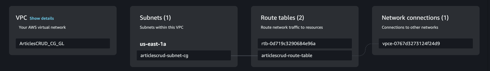

## DynamoDB:
I then define the dynamoDB data base and set the articles table. In order for the lambda functions to access it in the custom VPC I also need to create a VPC endpoint for it to be accessible.

```yaml

  DynamoDBEndpoint:
    Type: 'AWS::EC2::VPCEndpoint'
    Properties:
      ServiceName: !Sub 'com.amazonaws.${AWS::Region}.dynamodb'
      VpcId: !Ref CRUDVPC
      VpcEndpointType: Gateway
      RouteTableIds: [ !Ref rRouteTable ]

  ArticlesTable:
    Type: AWS::DynamoDB::Table
    Properties:
      TableName: !Ref pTableName
      AttributeDefinitions:
        - AttributeName: !Ref pAttributeName
          AttributeType: "S"
      KeySchema:
        - AttributeName: !Ref pAttributeName
          KeyType: "HASH"
      TimeToLiveSpecification:
        AttributeName: "ExpirationTime"
        Enabled: true
      ProvisionedThroughput:
        ReadCapacityUnits: "10"
        WriteCapacityUnits: "5"

```

The result is the creation of the table in dynamo DB and a vpc endpoint for it.

In DynamoDB
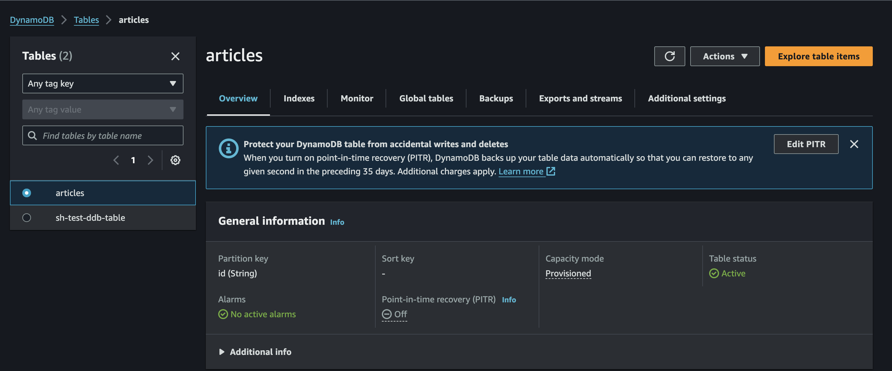

VPC endpoint
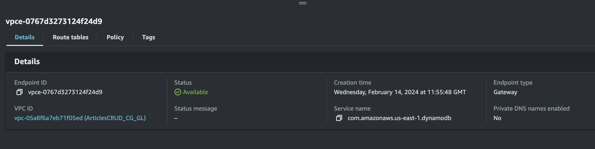

## ApiGateway

The api gets defined as a serverless resource. This will then have our lambdas attached to.

```yaml
  ApiGatewayApi:
    Type: AWS::Serverless::Api
    Properties:
      StageName: Test
    DependsOn:
      - AllArticlesLambda
```


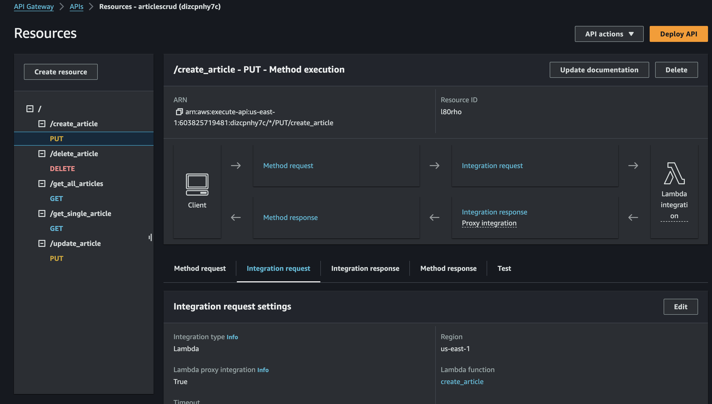

To take the example of get_all_articles, the lambda needs to have sufficient permission to access dynamoDB i create a role that the lambda will use. I have a role for each endpoint but they all follow the pattern of having a role name and a list of policies to attach to the role.


```yaml

Statement:
    - Effect: Allow
    Action:
        - 'dynamodb:Scan'


...

- Effect: Allow
Action:
    - 's3:GetObject*'

```
I add s3 permissions for get because the lambda functions are uploaded as individual zip files in S3. the role needs to have permissions to access those zips.

## Lambda Function
I then define the lambda function. AllArticles is shown as an example.

```yaml

 AllArticlesLambda:
    Type: AWS::Serverless::Function
    Properties:
      FunctionName: !Ref pGetAllArticles
      CodeUri: 
        Bucket: !Ref pBucketName
        Key: get_all_articles.zip
      Handler: get_all_articles.lambda_handler
      Role: !GetAtt AllArticlesRole.Arn
      Runtime: python3.12
      Events:
        ProxyApiRoot:
          Type: Api
          Properties:
            RestApiId: !Ref ApiGatewayApi
            Path: get_all_articles
            Method: GET 
      VpcConfig:
        SecurityGroupIds:
          - !Ref CrudSecurityGroup
        SubnetIds:
          - !Ref SubnetA
      Environment:
        Variables:
          TableName: !Ref pTableName
      LoggingConfig:
        LogGroup: !Ref ArticlesCRUDLogGroupGL
    DependsOn:
      - AllArticlesRole

```

Here define the zip file name and reference the pBucketName which has the s3 location. Recall the lambda function name being lambda_handler. I reference the function as ```get_all_articles.lambda_handler```. I also specify the runtime as python3.12. This is so AWS knows to run the lambda as python code (lambdas support a range of other languages such as nodeJS).

For the API gateway we specify the proxy root and the HTTP REST method, in this case, GET. We also specify the lambda belongs to our custom VPC and assign it to our subnet ID.

Our lambda function uses an environment variable for the dynamoDB table name. It is defined here under ```Environment```.

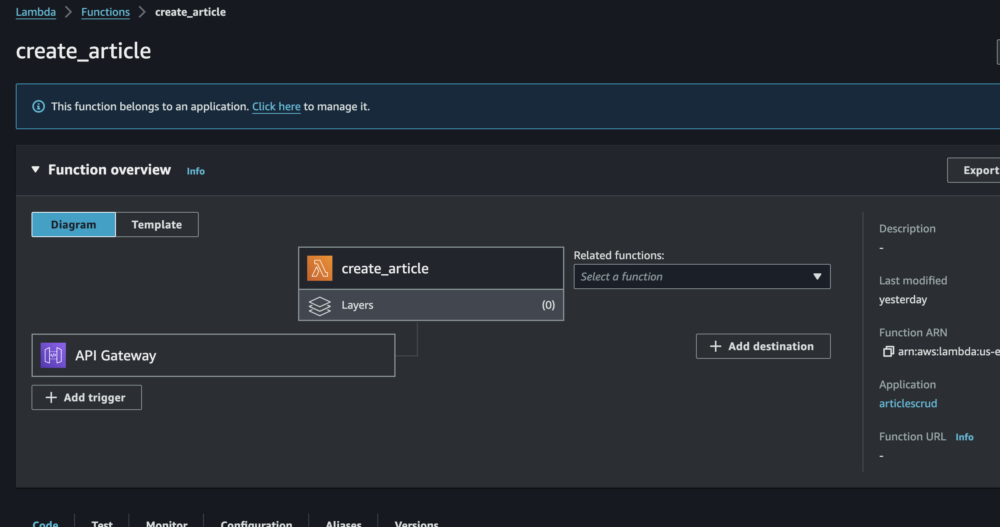

S3 bucket was made manually and zip files were uploaded manually.

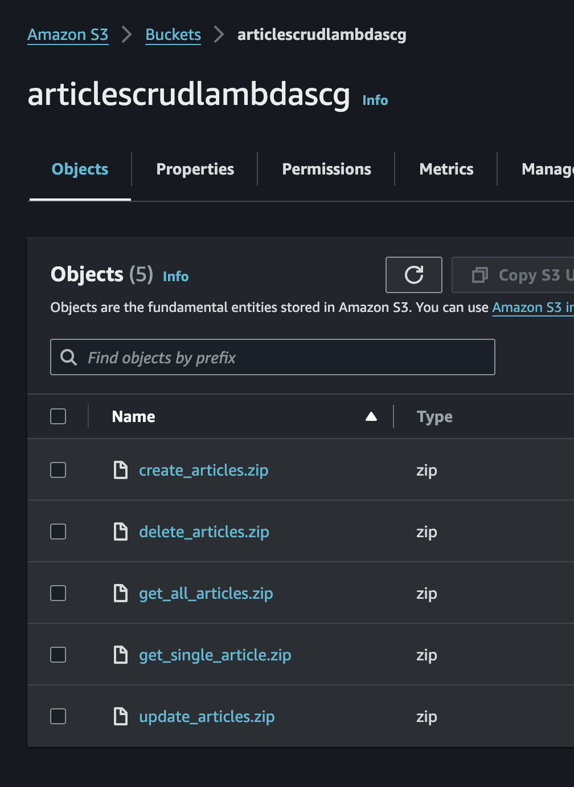

We also assign the logging to a log group ```ArticlesCRUDLogGroupGL```

```yaml

  ArticlesCRUDLogGroupGL:
    Type: AWS::Logs::LogGroup
    Properties:
      LogGroupName: "/aws/lambda/articles_grp_gl"
      RetentionInDays: !Ref pRetentionInDays
    DependsOn: 
      - ArticlesCrudSNSTopic
```

I define retentionInDays from parameters. Accumulating logs will incur charges from AWS so setting this makes our application more cost effective.

## Cloudwatch Alarms

I then create an alarm that watches the log group and triggers when errors occurs. This is achieved by creating an SNS topic and associating a metric to it.

```yaml

ArticlesCrudSNSTopic:
    Type: AWS::SNS::Topic
    Properties:
      Subscription:
      - Endpoint: !Ref pCloudWatchEmail
        Protocol: email-json

  ArticlesCrudMetrics: 
    Type: AWS::Logs::MetricFilter
    DependsOn: ArticlesCrudSNSTopic
    Properties: 
      LogGroupName: !Ref "ArticlesCRUDLogGroupGL"
      FilterPattern: '[ERROR, error]'
      MetricTransformations: 
        - MetricValue: '1'
          MetricNamespace: 'Errors'
          MetricName: 'ErrorCount'

  ArticlesCRUDErrorAlarm:
    Type: AWS::CloudWatch::Alarm
    DependsOn: ArticlesCrudMetrics
    Properties:
      AlarmName: ArticlesCrudErrorAlarm
      AlarmActions: 
        - !Ref ArticlesCrudSNSTopic
      MetricName: ErrorCount
      Namespace: Errors
      ComparisonOperator: GreaterThanOrEqualToThreshold
      EvaluationPeriods: '1'
      Period: '900'
      Statistic: Sum
      Threshold: '3'
      TreatMissingData: notBreaching
```

The metric will look in the logs for any error messages. The SNS topic specifies the email address from the parameters and the format to be email-json.
The Alarm specifies when it is triggered and the threshold.

When the lambda fails I end up getting an email like this.

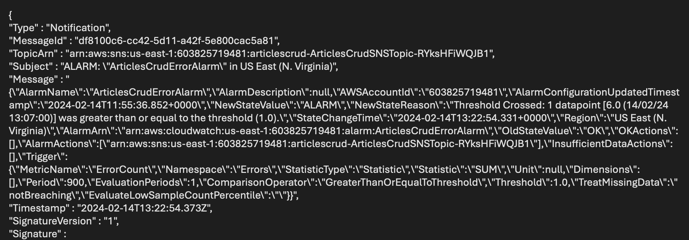

# Running the Cloud Formation script

I run the cloudformation script in AWS by uploading it. Once complete a stack is created. You can then go into AWS and inspect the different resources that were provisioned. You can also got to the API gateway and try the endpoints out.

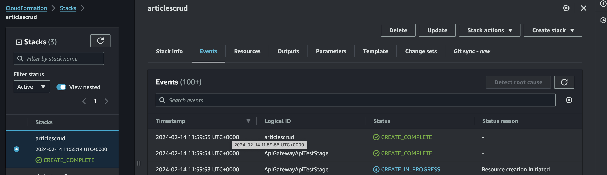

# Conclusion

This project as a good head first introduction to AWS and cloud formation as well as using boto3. I was introduced to a good range of AWS resources.
I got a lot of good feed back from Global Logic people to help with best practices.
I would improve on this by introducing CICD to automatically redeploy the resources and Create and upload zip files to AWS.

Thanks for reading and I wish you all the best in your AWS journey.