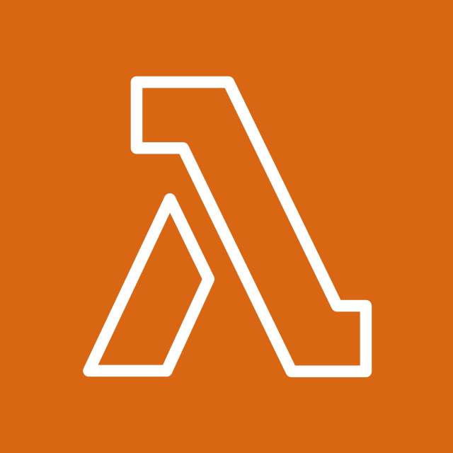
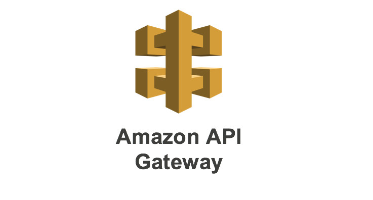
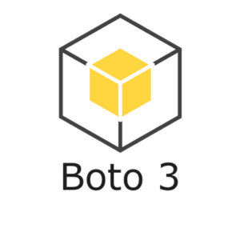
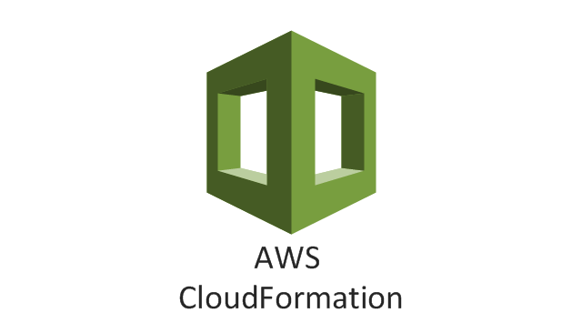
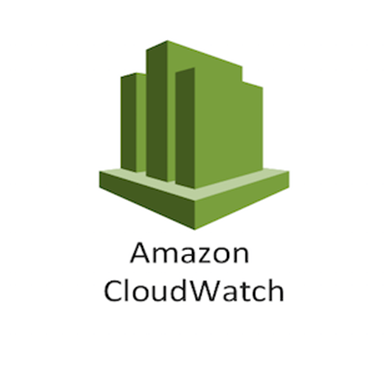

# CRUD Application with AWS Lambdas Deployed with Cloud Formation

## Introduction

As part of my onboarding to a finance client I was required to learn some AWS skills. I have only dabbled with AWS as a hobby and necer used it directly on a project.

To upskill for this role I created a REST API using AWS resources and deployed it into a VPC via Cloud formation.

This post goes into the Technologies I used and the implementation.

Ive tried to implement a solution that automates as much as possible as well as build an API that us unit tested.

## Technologies

For this Project I use
<ul>
<li><a href="https://www.python.org/">Python</a></li>
<li><a href="https://pypi.org/project/boto3/">boto3</a> A python library that serves as an AWS client. Used to interact with AWS resources. We use this in our lambda functions to Perform CRUD operations against dynamoDB</li>
<li><a href="https://aws.amazon.com/dynamodb/">AWS DynamoDB</a> A NoSQL Serverless DB service managed by AWS and as such requires no installation on your part you just connect to it through boto3 using an IAM role with sufficient permissions.. We use this service as the DB for our CRUD application. </li> 
<li><a href="https://aws.amazon.com/pm/lambda/?gclid=Cj0KCQiA5rGuBhCnARIsAN11vgSwbY2VZZMY59uih7jf0i8xING5E40hRSexnVEdsSTKoGndmdu3xqgaAn_FEALw_wcB&trk=27324d1f-ee08-40b9-8e7b-5ac228e2fecc&sc_channel=ps&ef_id=Cj0KCQiA5rGuBhCnARIsAN11vgSwbY2VZZMY59uih7jf0i8xING5E40hRSexnVEdsSTKoGndmdu3xqgaAn_FEALw_wcB:G:s&s_kwcid=AL!4422!3!651612449951!e!!g!!aws%20lambda!19836376234!148728884764">AWS Lambdas</a> Lambdas are a serverless AWS resource for writng a range of applications. No managing of services or environments. Code will be uploaded via a zip file to AWS. From my side this makes implementation fairly light weight and allows me to focus more in the application development rather than environment management.</li>
<li><a href="https://docs.aws.amazon.com/AWSCloudFormation/latest/UserGuide/Welcome.html">AWS CloudFormation</a> AWS's answer to infrastructure as code. We will be using this to build out the deployment of our application in the form of a version controlled script. This will include the providsioning of the custom VPC, IAM roles, lambdas, API gateway etc. Cloud formation works on the basis of describing resources as yml code (can also be JSON). When Run. AWS will produce a stack of your resources. The stack can be deleted which in turn will delete all the created resurces. It allows the provisioning of resources to be automated as well as groupes.</li>
<li><a href="https://aws.amazon.com/cloudwatch/">AWS CloudWatch</a> A service used for capturing application logs. I created a log group that our lambda functions used. I also set up an example of an alarm to send emails when lambda function fails.</li>
<li><a href="https://aws.amazon.com/api-gateway/">AWS API Gateway</a> The Lambdas will be exposed to the outside world as HTTP REST endpoints. API gatway facilitates this as a managed service. This allows lambdas to be swapped out when needed and it is yet another piece of infrastructure managed by AWS.</li>
<li><a href="https://aws.amazon.com/sns/">AWS Simple Notification Service</a> A managed publish and subscribe service. It is versatile messaging service with a number of use cases. For this project I use for sending Emails when the alarm is triggered (Application to person, A2P).</li>
</ul>

# Implementation

I orginally started out this  project by building it manually withing AWS. Once I got it working I then implemented it cloudformation.
Here I will try to demonstrate the key components side by side.

